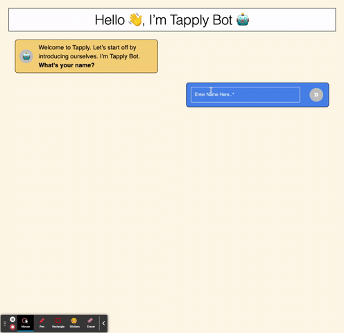
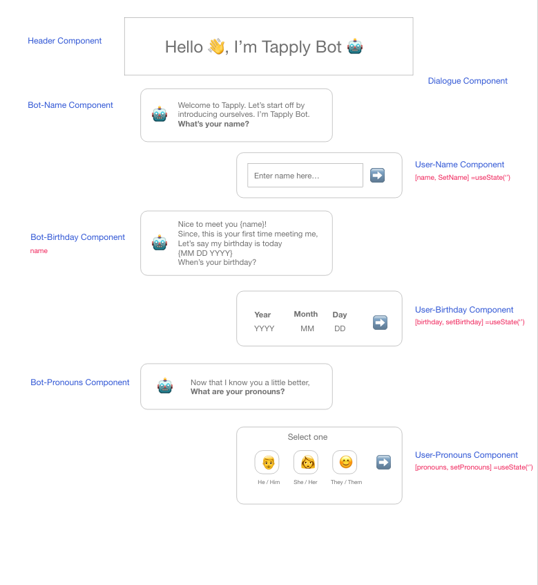
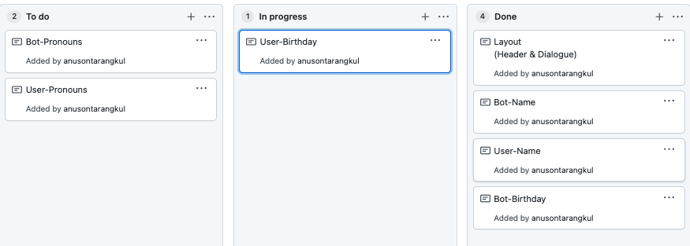
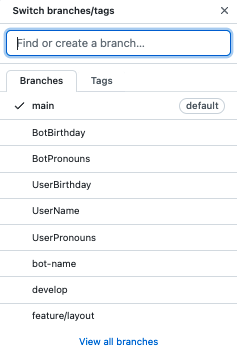

# Tapply Bot

An interactive bot to chat with.

## Desktop



## Table of Contents

|                                         |                                         |                                             |
| :-------------------------------------: | :-------------------------------------: | :-----------------------------------------: |
|       [Introduction](#tapply-bot)       | [Table of Contents](#table-of-contents) | [Development Process](#development-process) |
|             [Tests](#tests)             |        [Deployment](#deployment)        |    [Code Hightlights](#code-highlights)     |
| [Technologies Used](#Technologies-Used) |           [Credits](#Credits)           |             [License](#License)             |

## Development Process

### Created Mockup in Adobe XD.



### Used GitHub Projects and Branches to organize work flow.

#### Projects



#### Branches



### Development

The Header was a stateless component for the appl. The Dialogue component was the parent component for the components involving the User and Bot. React useState Hooks were usered to keep state of the name, birthday, and gender. There were hooks for those values and hooks for once those values are completed to update the next dialogue conversation.

## Tests

Unit tests were created.

```
npm test
```

## Deployment

[Deployed](https://tapply-bot.netlify.app/) using netlify.

### Code Highlights

This is the function for submitting the user name. The function first validates that the name is filled out. Next it trims unecessary space for the name. The first index is taken as the index and we update the completedName state to be true in order to render the next dialogue.

```JavaScript
  const submitNameHandler = (e) => {
    if (name.length === 0) return;
    setName(name.trim());
    setInitial(name[0]);
    setCompletedName(true);
  };
```

Conditional render a Box element once the user fills out the name. THe state is updated for completedName to be true and a new Box is rendered showing the name.

```JavaScript
  if (completedName) {
    return (
      <Box
        sx={{
          marginTop: '35px',
          marginLeft: 'auto',
          display: 'flex',
          border: '2px black solid',
          maxWidth: '500px',
          borderRadius: '10px',
          alignItems: 'center',
          padding: '10px 10px',
          backgroundColor: '#4180ec',
          color: 'white',
        }}
      >
        <Typography sx={{ fontSize: '22px', marginLeft: '5px' }}>
          Hi Tapply Bot! My name is <strong>{name}</strong>.
        </Typography>
        <Avatar
          sx={{
            height: '50px',
            width: '50px',
            margin: '6.5px 5px 6.5px auto',
          }}
        >
          {initial}
        </Avatar>
      </Box>
    );
  }
```

## Technologies Used

### Front End Library

- [React](https://reactjs.org/)

### UI Library

- [MUI](https://mui.com/)

### Testing

- [react-testing-library](https://reactjs.org/docs/testing.html)

## Credits

|                           |                                                                                                                                                                                                       |
| ------------------------- | ----------------------------------------------------------------------------------------------------------------------------------------------------------------------------------------------------- |
| **David Anusontarangkul** | [ LinkedIn](https://www.linkedin.com/in/anusontarangkul/) [ GitHub](https://github.com/anusontarangkul) |

## License

Copyright 2021

Permission is hereby granted, free of charge, to any person obtaining a copy of this software and associated documentation files (the "Software"), to deal in the Software without restriction, including without limitation the rights to use, copy, modify, merge, publish, distribute, sublicense, and/or sell copies of the Software, and to permit persons to whom the Software is furnished to do so, subject to the following conditions:

The above copyright notice and this permission notice shall be included in all copies or substantial portions of the Software.

THE SOFTWARE IS PROVIDED "AS IS", WITHOUT WARRANTY OF ANY KIND, EXPRESS OR IMPLIED, INCLUDING BUT NOT LIMITED TO THE WARRANTIES OF MERCHANTABILITY, FITNESS FOR A PARTICULAR PURPOSE AND NONINFRINGEMENT. IN NO EVENT SHALL THE AUTHORS OR COPYRIGHT HOLDERS BE LIABLE FOR ANY CLAIM, DAMAGES OR OTHER LIABILITY, WHETHER IN AN ACTION OF CONTRACT, TORT OR OTHERWISE, ARISING FROM, OUT OF OR IN CONNECTION WITH THE SOFTWARE OR THE USE OR OTHER DEALINGS IN THE SOFTWARE.
